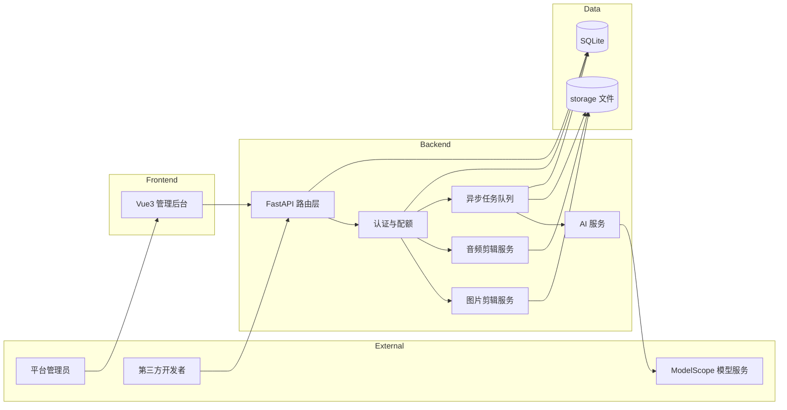
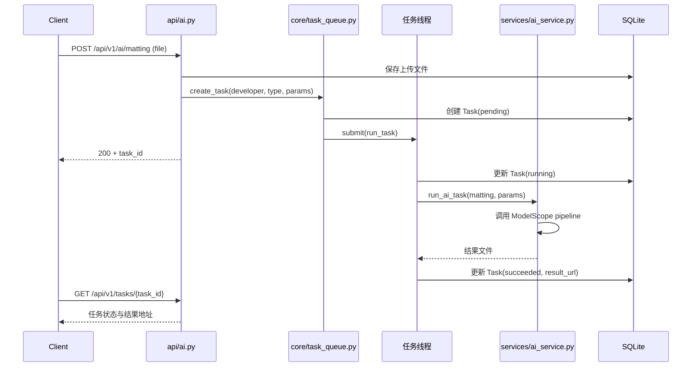
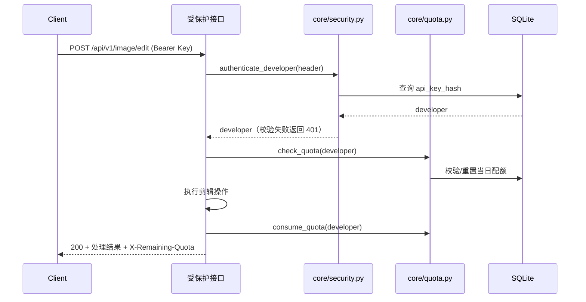

# 架构设计

## 概述

媒体剪辑 API 服务平台是一个对外提供媒体剪辑能力的开放 API 平台。它将 Pillow、OpenCV、FFmpeg 处理引擎与 ModelScope AI 能力封装为标准化 REST API，使第三方开发者能够通过申请 API Key 的方式调用图片剪辑、音频剪辑和 AI 智能处理接口。系统内置开发者注册、API Key 认证、每日配额限流、异步任务队列、调用统计与可视化管理后台，满足「申请对接 → 获取 Key → 调用接口」的完整服务闭环。

## 技术栈

**语言与运行时**
- Python 3.11
- Node.js 22（前端构建）

**框架**
- FastAPI（后端 Web 框架，自带 Swagger 文档）
- SQLAlchemy 2.0（ORM）
- Vite + Vue3 + Element Plus（前端管理后台）

**数据存储**
- SQLite（开发者、任务、调用日志，WAL 模式支持多线程读写）

**处理引擎**
- Pillow 12（图片裁切、缩放、水印、格式转换）
- OpenCV 5（图片滤镜）
- FFmpeg 5.1（音频裁剪、拼接、音量、格式转换）
- ModelScope 1.39（AI 抠图、图像增强、ASR、TTS）

**外部服务**
- ModelScope 模型推理（通过 `MODELSCOPE_API_TOKEN` 凭证调用）

## 项目结构

```
project-root/
├── backend/                # 后端服务（Python FastAPI）
│   ├── app/
│   │   ├── main.py         # 应用入口、中间件、路由注册
│   │   ├── config.py       # 环境变量与配置
│   │   ├── database.py     # SQLAlchemy 引擎与会话
│   │   ├── models.py       # ORM 数据模型
│   │   ├── schemas.py      # Pydantic 请求/响应模型
│   │   ├── core/           # 横切关注点
│   │   │   ├── security.py     # API Key、管理员 JWT
│   │   │   ├── quota.py        # 配额限流
│   │   │   └── task_queue.py   # 异步任务队列
│   │   ├── services/       # 业务逻辑
│   │   │   ├── image_service.py # Pillow/OpenCV 图片剪辑
│   │   │   ├── audio_service.py # FFmpeg 音频剪辑
│   │   │   └── ai_service.py    # ModelScope AI 封装
│   │   └── api/            # 路由层
│   │       ├── dev.py      # 开发者注册/Key 管理
│   │       ├── image.py    # 图片剪辑接口
│   │       ├── audio.py    # 音频剪辑接口
│   │       ├── ai.py       # AI 任务提交
│   │       ├── tasks.py    # 任务状态查询
│   │       ├── result.py   # 结果下载
│   │       └── admin.py    # 管理后台 API
│   ├── storage/            # 上传与结果文件存储
│   └── tests/              # 单元与集成测试
├── frontend/               # 管理后台（Vite + Vue3）
│   └── src/
│       ├── views/          # 登录/开发者/统计/API 申请页
│       └── api/index.js    # 后端请求封装
├── start.sh                # 前后端启动脚本
└── .env.example            # 环境变量模板
```

**入口点**
- `backend/app/main.py` - FastAPI 应用入口，挂载全部路由与调用日志中间件
- `backend/app/core/task_queue.py` - 后台任务线程池与清理线程
- `frontend/src/main.js` - Vue3 应用入口，路由守卫

## 子系统

### API 路由层
**目的**: 暴露公开接口与管理接口，处理请求参数与响应
**位置**: `backend/app/api/`
**关键文件**: `dev.py`, `image.py`, `audio.py`, `ai.py`, `tasks.py`, `result.py`, `admin.py`
**依赖**: core 模块、services 模块、schemas、models
**被依赖**: FastAPI 应用入口

### 认证与配额
**目的**: API Key 生成与校验、管理员 JWT、每日配额限流
**位置**: `backend/app/core/`
**关键文件**: `security.py`, `quota.py`
**依赖**: models、config
**被依赖**: 全部受保护 API 路由

### 异步任务队列
**目的**: 将耗时 AI 任务放入进程内线程池异步执行，维护任务状态机并定期清理过期结果
**位置**: `backend/app/core/task_queue.py`
**依赖**: ai_service、models
**被依赖**: AI 任务提交接口

### 图片剪辑服务
**目的**: 基于 Pillow 与 OpenCV 实现裁切、缩放、滤镜、水印、格式转换
**位置**: `backend/app/services/image_service.py`
**依赖**: Pillow、OpenCV、numpy
**被依赖**: 图片剪辑接口

### 音频剪辑服务
**目的**: 基于 FFmpeg 子进程实现裁剪、拼接、音量调整、格式转换
**位置**: `backend/app/services/audio_service.py`
**依赖**: FFmpeg 命令行
**被依赖**: 音频剪辑接口

### AI 服务
**目的**: 封装 ModelScope pipeline，提供抠图、增强、ASR、TTS 四种能力
**位置**: `backend/app/services/ai_service.py`
**依赖**: modelscope 库、config（凭证）
**被依赖**: 异步任务队列

## 架构图

### 系统架构



### 异步 AI 任务时序



### 认证与配额流程



## 关键流程

### 开发者对接流程
1. 开发者调用 `POST /api/v1/dev/register` 提交名称与邮箱，系统生成 32 位随机 API Key 并仅以 SHA-256 哈希入库，明文只返回一次
2. 开发者携带 `Authorization: Bearer <key>` 调用剪辑接口，系统校验 Key 有效性并检查每日配额
3. 每次调用成功后配额计数 +1，响应头 `X-Remaining-Quota` 返回剩余额度，超出返回 429

### AI 任务执行流程
1. 提交 AI 任务后立即返回 `task_id`，任务以 pending 状态入库
2. 后台线程池调度执行，状态流转 pending → running → succeeded / failed
3. 结果文件写入 `storage/results/{task_id}/`，开发者通过状态查询获取下载地址
4. 超过 24 小时的完成任务由后台清理线程删除结果文件

## 设计决策

1. **进程内线程池而非外部队列**：采用 `ThreadPoolExecutor`（2 个 worker）+ SQLite 任务表，免去 Redis/Celery 部署依赖，单进程部署即可运行
2. **SQLite WAL 模式**：启用 WAL 与 30 秒 busy_timeout，支持后端请求线程与任务线程并发读写
3. **API Key 哈希存储**：数据库仅保存 SHA-256 哈希，明文 Key 在注册时一次性返回，降低泄露风险
4. **AI 凭证占位符**：`MODELSCOPE_API_TOKEN` 从环境变量读取，未配置时 AI 接口返回 503 而非静默失败
5. **前端反向代理**：Vite dev server 将 `/api` 代理到 `http://localhost:8000`，避免跨域，单端口对外暴露
