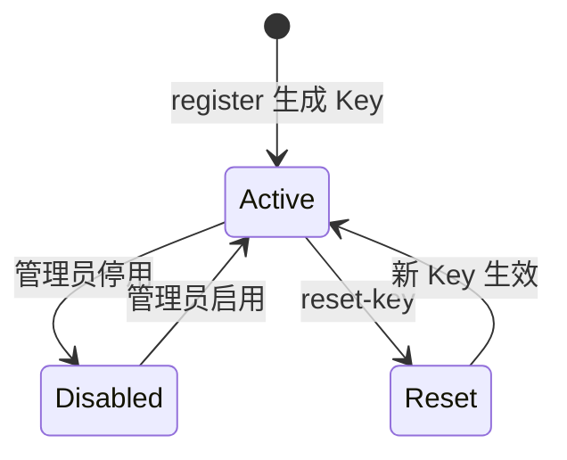
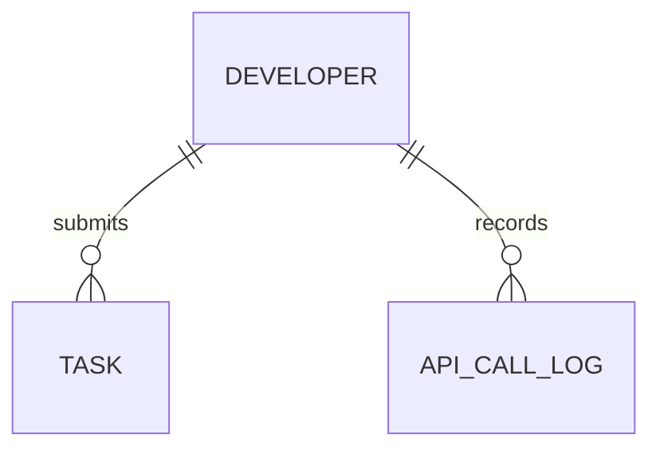

# API Key 与配额

开发者调用平台接口的身份凭证与资源使用计量机制。

## 什么是 API Key？

API Key 是开发者在注册时获得的 32 位随机十六进制字符串，用于在调用剪辑接口时证明身份。系统仅以 SHA-256 哈希形式存储在 `developer.api_key_hash` 字段，明文只在注册与重置接口各返回一次。配额（quota）是平台为每位开发者设定的每日调用次数上限，用于公平分配处理资源。

**关键特征**:
- API Key 明文不落库，防止数据库泄露导致凭证失效
- 配额按自然日计费，跨日自动重置
- 请求响应头 `X-Remaining-Quota` 实时反馈剩余额度

## 代码位置

| 方面 | 位置 |
|------|------|
| 模型 | `backend/app/models.py`（Developer 表） |
| Key 生成与校验 | `backend/app/core/security.py` |
| 配额逻辑 | `backend/app/core/quota.py` |
| API 路由 | `backend/app/api/dev.py` |
| 数据库 | `developer` 表 |
| 测试 | `backend/tests/test_security.py`、`test_quota.py` |

## 结构

```python
class Developer(Base):
    id: int             # 主键
    name: str           # 开发者名称
    email: str          # 联系邮箱
    api_key_hash: str   # API Key 的 SHA-256 哈希（唯一）
    status: str         # active / disabled
    quota_limit: int    # 每日配额上限
    quota_used: int     # 当日已用配额
    quota_date: Date    # 配额计费日期
```

## 不变量

1. **Key 哈希唯一**: 每个 `api_key_hash` 在表中唯一，SHA-256 碰撞可忽略
2. **配额非负**: `quota_used` 不会超过 `quota_limit`，超额请求被 429 拒绝
3. **跨日重置**: `quota_date` 早于当天时，使用量清零并按当天重新计费

## 生命周期



## 关系



| 关联概念 | 关系 | 描述 |
|---------|------|------|
| 异步任务 | 提交 | 每个开发者可提交多个 AI 任务 |
| 调用日志 | 记录 | 每次成功认证的调用写入一条日志 |
