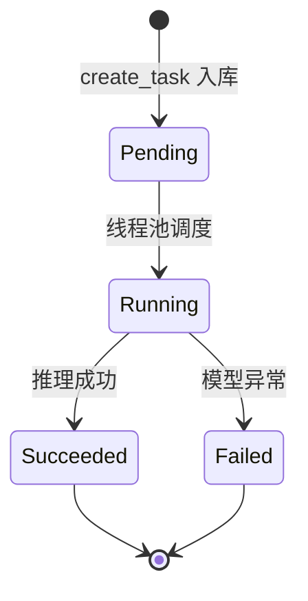
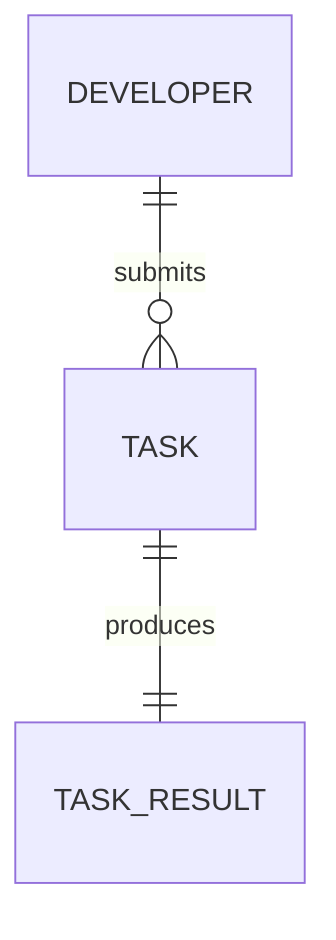

# 异步任务

AI 能力（抠图、增强、ASR、TTS）处理耗时的异步执行单元。

## 什么是异步任务？

异步任务是系统对耗时 AI 处理请求的包装。开发者提交任务后接口立即返回 `task_id`，后台线程池在独立线程中执行模型推理，开发者通过轮询任务状态接口获取处理结果。这种方式避免同步接口因模型推理耗时过长而超时，也使平台能够按先进先出顺序调度计算资源。

**关键特征**:
- 对外暴露 32 位 UUID `task_id`，与数据库自增主键解耦
- 状态机单向流转：pending → running → succeeded / failed
- 结果文件持久化于 `storage/results/{task_id}/`，超过 24 小时自动清理

## 代码位置

| 方面 | 位置 |
|------|------|
| 模型 | `backend/app/models.py`（Task 表） |
| 队列与调度 | `backend/app/core/task_queue.py` |
| 任务执行 | `backend/app/services/ai_service.py` |
| API 路由 | `backend/app/api/ai.py`、`tasks.py`、`result.py` |
| 数据库 | `task` 表 |
| 测试 | `backend/tests/test_task_queue.py` |

## 结构

```python
class Task(Base):
    id: int              # 自增主键
    task_id: str         # 对外 UUID（唯一）
    developer_id: int    # 提交者
    task_type: str       # matting / enhance / asr / tts
    status: str          # pending / running / succeeded / failed
    params: str          # 请求参数 JSON
    result_url: str      # 结果文件相对路径
    error: str           # 失败原因
```

## 不变量

1. **任务 ID 对外唯一**: `task_id`（UUID）全局唯一且不可变
2. **状态单向流转**: 任务状态只能按 pending → running → succeeded/failed 推进
3. **归属隔离**: 状态查询与结果下载仅允许任务归属开发者访问
4. **结果超时清理**: 完成任务超过 24 小时，结果文件被后台清理线程删除

## 生命周期



### 状态描述

| 状态 | 描述 | 允许的转换 |
|------|------|-----------|
| `pending` | 已入库，等待线程池调度 | → running |
| `running` | 正在执行模型推理 | → succeeded, failed |
| `succeeded` | 成功，`result_url` 指向结果 | （终态） |
| `failed` | 失败，`error` 含原因 | （终态） |

## 关系



| 关联概念 | 关系 | 描述 |
|---------|------|------|
| API Key 与配额 | 提交 | 任务归属于具体开发者，提交时消耗配额 |
| ModelScope AI 能力 | 执行 | 任务线程调用 `ai_service.run_ai_task` 完成推理 |
