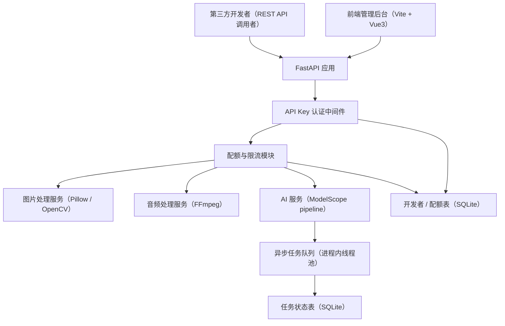

# 媒体剪辑 API 服务平台 设计文档

Feature Name: 2026-08-18-media-edit-api
Updated: 2026-08-18

## Description

本系统是独立部署的对外媒体剪辑 API 服务平台。平台使用 FastAPI 提供 REST API，将 Pillow、OpenCV、FFmpeg 与 ModelScope AI 能力封装为标准接口。系统包含开发者 API Key 申请与认证、配额限流、异步任务队列、可视化管理后台与 Swagger 接口文档。

## Architecture



分层说明：

- **API 层**: FastAPI 路由，公开开发者接口与管理接口
- **中间件层**: API Key 认证、配额计数、调用日志
- **服务层**: 图片处理、音频处理、AI 能力封装
- **任务层**: 进程内线程池异步执行耗时 AI 任务，任务状态持久化到 SQLite
- **存储层**: SQLite 数据库存储开发者、配额、任务、调用日志
- **前端层**: Vite + Vue3 管理后台，通过 `/api` 反向代理访问后端

## Components and Interfaces

### 1. 后端服务（backend/）

技术栈：Python 3.11、FastAPI、Uvicorn、SQLAlchemy、SQLite、Pillow、OpenCV、FFmpeg、modelscope

```
backend/
├── app/
│   ├── main.py                 # FastAPI 入口，注册路由与中间件
│   ├── config.py               # 配置（ModelScope 环境变量占位符）
│   ├── database.py             # SQLAlchemy 引擎与会话
│   ├── models.py               # ORM 数据模型
│   ├── schemas.py              # Pydantic 请求/响应模型
│   ├── core/
│   │   ├── security.py         # API Key 生成与校验、管理员 JWT
│   │   ├── quota.py            # 配额计数与限流
│   │   └── task_queue.py       # 进程内异步任务队列
│   ├── services/
│   │   ├── image_service.py    # Pillow / OpenCV 图片剪辑
│   │   ├── audio_service.py    # FFmpeg 音频剪辑
│   │   └── ai_service.py       # ModelScope AI 能力
│   └── api/
│       ├── dev.py              # 开发者注册、Key 管理
│       ├── image.py            # 图片剪辑接口
│       ├── audio.py            # 音频剪辑接口
│       ├── ai.py               # AI 任务提交接口
│       ├── tasks.py            # 任务状态查询
│       └── admin.py            # 管理后台 API
├── storage/
│   ├── uploads/                # 上传文件
│   └── results/                # 处理结果
└── media.db                    # SQLite 数据库
```

### 2. 前端管理后台（frontend/）

技术栈：Vite + Vue3 + Element Plus

```
frontend/
├── src/
│   ├── views/
│   │   ├── Login.vue           # 管理员登录
│   │   ├── Developers.vue      # 开发者列表与管理
│   │   ├── Quotas.vue          # 配额管理
│   │   ├── Stats.vue           # 调用统计
│   │   └── Dashboard.vue       # 概览
│   ├── api/index.js            # 后端请求封装
│   └── main.js
└── vite.config.ts              # /api 反向代理至后端
```

### 3. 公开接口定义

| 方法 | 路径 | 认证 | 说明 |
|------|------|------|------|
| POST | /api/v1/dev/register | 无 | 开发者注册，返回 API Key |
| POST | /api/v1/dev/reset-key | 无 | 重置 API Key |
| POST | /api/v1/image/edit | API Key | 图片剪辑（同步） |
| POST | /api/v1/audio/edit | API Key | 音频剪辑（同步） |
| POST | /api/v1/ai/{task_type} | API Key | 提交 AI 任务（异步） |
| GET | /api/v1/tasks/{task_id} | API Key | 查询任务状态 |
| GET | /api/v1/result/{file_id} | API Key | 下载处理结果文件 |
| POST | /api/v1/admin/login | 无 | 管理员登录 |
| GET | /api/v1/admin/developers | 管理员 | 开发者列表 |
| PUT | /api/v1/admin/developers/{id} | 管理员 | 修改状态/配额 |
| GET | /api/v1/admin/stats | 管理员 | 调用统计 |

### 4. 图片剪辑服务

`image_service.py` 使用 Pillow 与 OpenCV 实现：

- 裁切：Pillow `crop(box)`，参数 `box` 四元组
- 缩放：Pillow `resize`，参数 `width`、`height`
- 滤镜：OpenCV 预定义滤镜（灰度、模糊、锐化、边缘、浮雕），参数 `filter_type`
- 水印：Pillow `ImageDraw.text` 叠加，参数 `text`、`position`、`size`、`color`
- 格式转换：Pillow `save`，参数 `output_format`（png/jpeg/webp）

### 5. 音频剪辑服务

`audio_service.py` 通过 subprocess 调用 FFmpeg 实现：

- 裁剪：`ffmpeg -ss START -to END -i input -c copy output`
- 拼接：`ffmpeg -i a.mp3 -i b.mp3 -filter_complex concat=n=2:v=0:a=1 -c copy output`
- 音量：`ffmpeg -i input -filter:a volume=GAIN output`
- 格式转换：`ffmpeg -i input -codec:a libmp3lame -b:a 192k output.mp3`

### 6. AI 服务（ModelScope）

`ai_service.py` 使用 modelscope pipeline，模型通过配置文件声明。ModelScope 访问凭证由平台部署者通过环境变量提供（占位符模式）：

```python
# config.py
MODELSCOPE_API_TOKEN = os.getenv("MODELSCOPE_API_TOKEN", "")   # 部署者填入
```

AI 任务类型与模型：

| 任务类型 | pipeline 名称 | 说明 |
|---------|--------------|------|
| matting | image-matting | AI 抠图，输出前景透明图 |
| enhance | image-enhance | 图像增强/修复 |
| asr | auto-speech-recognition | 语音转文字 |
| tts | text-to-speech | 文字转语音 |

### 7. 异步任务队列

`task_queue.py` 实现进程内线程池队列：

1. 提交 AI 任务时创建 `Task` 记录（状态 pending），返回 `task_id`
2. 后台工作线程从队列取任务，执行 AI 服务，更新状态 running → succeeded / failed
3. 结果文件写入 `storage/results/{task_id}/`，状态查询返回下载地址
4. 超过 24 小时的完成任务由后台清理器删除结果文件

## Data Models

### developer 表

| 字段 | 类型 | 说明 |
|------|------|------|
| id | int PK | 自增主键 |
| name | str | 开发者名称 |
| email | str | 联系邮箱 |
| api_key | str unique | 32 位随机 API Key（hash 存储） |
| status | str | active / disabled |
| quota_limit | int | 每日配额上限 |
| quota_used | int | 当日已用配额 |
| quota_date | date | 配额计费日期 |
| created_at | datetime | 创建时间 |

### task 表

| 字段 | 类型 | 说明 |
|------|------|------|
| id | int PK | 自增主键 |
| task_id | str unique | UUID 对外任务 ID |
| developer_id | int FK | 提交开发者 |
| task_type | str | matting / enhance / asr / tts |
| status | str | pending / running / succeeded / failed |
| params | text | 请求参数 JSON |
| result_url | str | 结果文件相对路径 |
| error | text | 失败原因 |
| created_at | datetime | 创建时间 |
| updated_at | datetime | 更新时间 |

### api_call_log 表

| 字段 | 类型 | 说明 |
|------|------|------|
| id | int PK | 自增主键 |
| developer_id | int FK | 调用者 |
| endpoint | str | 接口路径 |
| status_code | int | 响应状态码 |
| created_at | datetime | 调用时间 |

## Correctness Properties

1. API Key 以哈希形式存储，系统 SHALL 永不明文返回已签发 Key
2. 开发者每日配额按 `quota_date` 重置，跨日请求 SHALL 重新计费
3. 无效 Key、超额配额、非法参数 SHALL 返回对应 4xx 状态码且不消耗处理资源
4. AI 任务状态机 SHALL 满足 pending → running → succeeded / failed 单向流转
5. 上传文件 SHALL 限制大小（图片 20MB、音频 100MB）并校验文件头

## Error Handling

| 错误场景 | 状态码 | 响应体 |
|---------|--------|--------|
| API Key 无效 | 401 | `{"error": "invalid api key"}` |
| 配额不足 | 429 | `{"error": "quota exceeded", "retry_after": 3600}` |
| 参数非法 | 400 | `{"error": "invalid parameters", "detail": "..."}` |
| 文件损坏 | 400 | `{"error": "invalid file format"}` |
| 文件过大 | 413 | `{"error": "file too large"}` |
| ModelScope 不可用 | 503 | `{"error": "AI service unavailable"}` |
| 任务不存在 | 404 | `{"error": "task not found"}` |
| 内部错误 | 500 | `{"error": "internal server error"}` |

## Test Strategy

- 单元测试：图片/音频服务各操作的正确性与边界参数
- 接口测试：开发者注册、Key 认证、配额限流、任务提交流程
- 异步测试：任务状态流转与结果获取
- 使用 pytest + FastAPI TestClient，SQLite 内存库运行

## References

[^1]: (.monkeycode/specs/media-edit-api/requirements.md) - 需求文档
